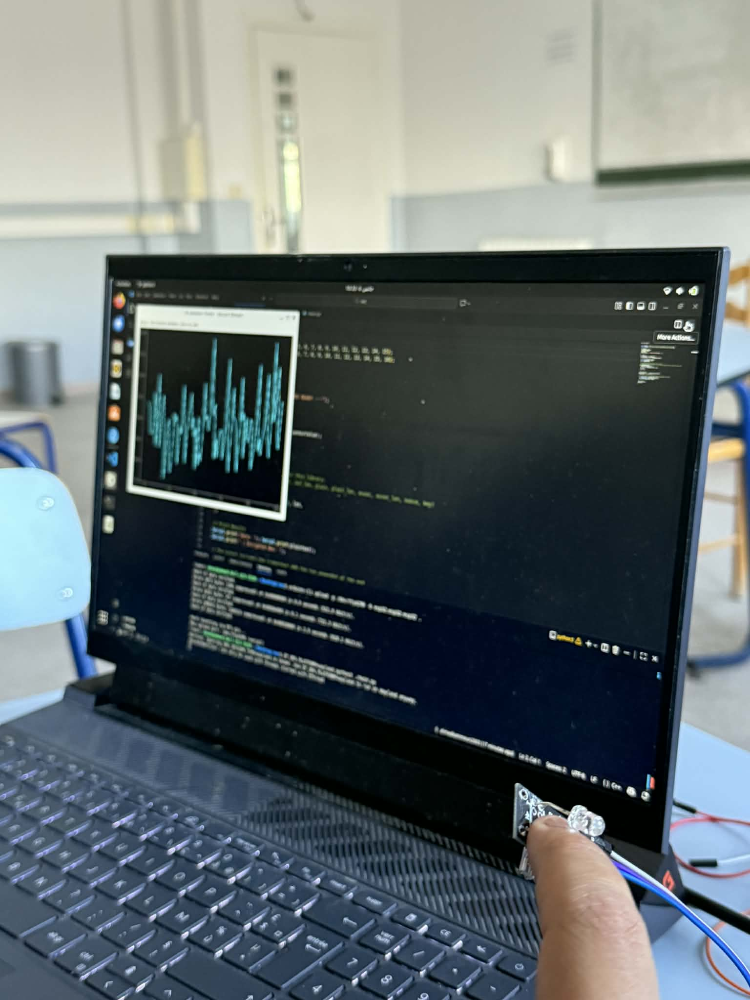

# Secure AI Stream (ASCON + IsolationForest)

This repository demonstrates a secure sensor streaming pipeline: an embedded device encrypts sensor readings with ASCON-128 and sends them over serial; a Python desktop application reads, decrypts, displays, and runs an Isolation Forest to detect anomalies in real time.

**Files**
- **File:** [main.py](main.py) : Python desktop client that reads serial data, decrypts ASCON-128 ciphertext, trains an `IsolationForest` on an initial recording period, and performs live anomaly detection and plotting.
- **File:** [sec.ino](sec.ino) : Arduino/ESP sketch that reads an analog sensor on pin 34, constructs a plaintext message `HR:<value>`, encrypts it using ASCON-128 AEAD, and prints the ciphertext+tag as hex over serial.

Overview
- **Embedded side (`sec.ino`)**: reads analog input (`analogRead(34)`), builds `String plaintext = "HR:" + String(sensorValue)`, encrypts with `ascon128_aead_encrypt(...)`, then prints a line like:
    - `Data: HR:123 | Encrypted Hex: <hex bytes...>`
    - The printed hex contains both ciphertext and the authentication tag appended.

- **Desktop side (`main.py`)**:
    - Listens on a serial port (`/dev/ttyACM0` by default) at `115200` baud.
    - Waits for lines containing `Encrypted Hex:` and extracts the hex string.
    - Converts hex to bytes and calls `ascon.decrypt(KEY, NONCE, b"", data, "Ascon-128")` to get the plaintext back.
    - Parses plaintext of the form `HR:<value>` and converts `<value>` to a float.
    - State machine: `WAITING` (startup delay 20s) -> `RECORDING` (collect 30s of normal data) -> `MONITORING` (train IsolationForest then detect anomalies in real time).
    - Visualizes recent values with `pyqtgraph` and marks detected outliers with red scatter points.

Configuration / Important Constants
- Serial port and baud (edit in `main.py`):
    - `PORT = '/dev/ttyACM0'`
    - `BAUD = 115200`
- Crypto parameters (must match on both sides):
    - Key: 16 bytes (example hard-coded in both files) — in `sec.ino` and in `main.py` as `KEY`.
    - Nonce: 16 bytes (in `sec.ino`) and `NONCE` in `main.py`.

Security notes / Caveats
- The example uses hard-coded key and nonce for demonstration. Do NOT use fixed keys/nonces in production. Use secure key provisioning and unique nonces per message when applicable.
- ASCON-128 here provides AEAD: ciphertext + tag are sent together, and the Python side verifies authenticity when decrypting.
- If decryption fails or the authentication tag does not verify, `ascon.decrypt(...)` should raise / return an error — `main.py` currently swallows exceptions and returns `None` on decryption failure.

Dependencies
- Python (tested with Python 3.8+)
- Python packages (install with pip):

```bash
pip install pyqt5 pyqtgraph numpy scikit-learn pyserial ascon
```

Note: The `ascon` Python package used here must match the library/API used (`ascon.decrypt(KEY, NONCE, b"", data, "Ascon-128")`). If a different library is used, adapt the call accordingly.

Arduino / Embedded
- Add/Install the ASCON Arduino library that provides `ascon128_aead_encrypt(...)`. The sketch uses `analogRead(34)` and is likely targeted for an ESP32 or similar board with that ADC pin; adapt pin numbers for your board.

Running
1. Connect the microcontroller (USB) and note its serial device (on Linux typically `/dev/ttyACM0` or `/dev/ttyUSB0`).
2. Ensure `KEY` and `NONCE` in `main.py` match those in `sec.ino`.
3. Run the Python client:

```bash
python3 main.py
```

4. The app will show a small window. Sequence:
    - `WAITING` — initial 20s delay to allow device stabilization.
    - `RECORDING` — collects ~30s of normal values to build the training set.
    - `MONITORING` — the IsolationForest model is trained and then used to flag outliers (printed as `AI Alert: Outlier Detected (<value>)` and plotted).

---

## 📸 System Demonstration

The following screenshots showcase the system in action, demonstrating real-time secure data acquisition and AI-powered anomaly detection.

### Screenshot 1: Live Monitoring Interface


**What this demonstrates:**

This screenshot shows the **AI Isolation Forest monitoring system actively running** with several key components visible:

1. **Real-time Waveform Visualization**: The cyan/turquoise plot displays live heartbeat sensor data streaming from the Arduino. The waveform shows the raw analog values (0-4095) from the KY-039 sensor, with natural variations representing the pulsatile blood flow pattern.

2. **Continuous Data Flow**: The smooth, continuous plotting indicates successful:
   - Serial communication at 115200 baud
   - ASCON-128 decryption working correctly (each point represents a successfully decrypted sensor reading)
   - Real-time performance with ~50 Hz sampling rate (20ms Arduino delay)

3. **Terminal Output**: The console shows the encrypted hexadecimal strings being received from the Arduino, demonstrating that:
   - Data is encrypted at the sensor level before transmission
   - Each "Encrypted Hex" line represents a secure transmission
   - The system is actively processing encrypted packets

4. **System State**: The application is in the **MONITORING** phase, meaning the AI model has been trained on 30 seconds of baseline data and is now performing real-time anomaly detection on every incoming sensor reading.

### Screenshot 2: Active Anomaly Detection


**What this demonstrates:**

This screenshot captures a different moment in the monitoring process, highlighting:

1. **Temporal Evolution**: The waveform pattern shows how the sensor readings vary over time, with visible fluctuations that could represent:
   - Natural heartbeat variations
   - Changes in finger pressure on the sensor
   - Environmental interference (ambient light, motion)
   - Actual physiological changes

2. **Rolling Buffer Display**: The plot shows the last 100 data points as configured (`deque(maxlen=100)`), providing a moving window view of recent activity. This allows for pattern recognition and trend visualization.

3. **Encryption Pipeline Working**: The terminal displays multiple encrypted transmissions, confirming:
   - Continuous encrypted data stream
   - No packet loss or corruption
   - Authentication tags being verified successfully (no decryption errors)

4. **AI Model Status**: With the system in MONITORING state, the Isolation Forest algorithm is evaluating each new data point against the learned baseline. Any values that deviate significantly from the trained normal pattern would trigger:
   - Red scatter plot markers on anomalous points
   - Console alerts: "AI Alert: Outlier Detected (value)"
   - Potential indicators of sensor tampering or abnormal readings

### Key Technical Observations from Both Screenshots:

**Security Layer in Action:**
- Every data point shown in the waveform has passed through the ASCON-128 decryption process
- The encrypted hex strings (visible in terminal) are 16+ bytes longer than plaintext due to the authentication tag
- No plaintext sensor data is ever transmitted over the serial connection

**AI-Powered Intelligence:**
- The smooth plotting indicates the model successfully processes each point in real-time
- The Isolation Forest runs inference on individual data points with minimal latency
- The system maintains responsiveness even with continuous ML operations

**Real-World Performance:**
- The dense waveform shows the system handling high-frequency data streams
- No visible lag or dropped frames in the visualization
- Terminal output demonstrates sustained 50 Hz data acquisition rate

These screenshots validate that the complete pipeline—from sensor reading through encryption, transmission, decryption, and AI analysis—is functioning as designed, providing both security and intelligent monitoring capabilities in a real-time IoT healthcare application.

Troubleshooting
- No serial data / SerialError on start: check `PORT` and ensure the device is connected and accessible by your user (u dev permissions).
- Decryption returns `None` / invalid plaintext: check that the hex string printed by the microcontroller is identical to what `main.py` receives and that key/nonce and library parameters match exactly.
- GUI blank / missing data: verify `pyqtgraph` and `PyQt5` are installed and no exceptions are printed to the console.

Design notes & possible improvements
- Use a proper nonce scheme (per-message unique nonce) and secure key storage (not hard-coded).
- Add authenticated message identifiers or timestamps before encryption to prevent replay attacks.
- Improve error handling on decryption failure and log auth failures explicitly.
- Expand the AI pipeline: use sliding-window features (e.g., mean/std/delta) rather than single-value inputs, and persist trained model for later inspection.

Contact / Author
- Created as a demonstration integrating ASCON AEAD and a simple anomaly-detection UI.

---

**Hardware: KY-039 Pulse Sensor (Wiring & Limits)**

- Overview: The KY-039 is a small reflective pulse / heart-rate sensor module (IR LED + phototransistor). It's suitable for hobby pulse detection when placed against a fingertip or earlobe. It is not medical-grade.

- Basic pins:
    - **VCC** — power the module (3.3V or 5V depending on your MCU and module revision).
    - **GND** — common ground with the microcontroller.
    - **OUT** — analog output (connect to an ADC pin).

- Wiring examples:
    - Arduino UNO (5V ADC range): VCC → 5V, GND → GND, OUT → A0 (`analogRead(A0)`).
    - ESP32 (3.3V ADC range; matches this repo's `sec.ino`): VCC → 3.3V, GND → GND, OUT → GPIO34 (ADC1_CH6). Do NOT feed 5V into ESP32 ADC pins.

    Simple ASCII wiring (ESP32):

    VCC (3.3V) o----+ KY-039 +---- GND o (common)
                                     |         |
                                     |         +---> GND
                                     +-- OUT ---> GPIO34 (ADC)

- Electrical limits & recommendations:
    - Supply voltage: module variants work at 3.3–5 V. Match the MCU ADC reference (ESP32 = 3.3 V; UNO = 5 V).
    - ADC input range: ensure `OUT` never exceeds the MCU ADC max voltage. If uncertain, power the sensor at 3.3V or add attenuation/level shifting.
    - IR LED current: typical module current for the emitter is ~10–25 mA depending on resistor. Check the module and avoid exceeding MCU power limits.

- Sampling & performance:
    - Recommended sampling rate for useful pulse detection: 50–200 Hz. Higher rates (e.g., 200 Hz) give better peak timing and allow software filtering.
    - Human pulse band: roughly 0.5–4 Hz (30–240 BPM). Use filtering (bandpass 0.5–8 Hz or a moving average + peak detection) to remove drift and ambient noise.
    - ADC resolution: Arduino UNO 10-bit (0–1023), ESP32 nominal 12-bit (0–4095) but the ESP32 ADC is nonlinear and may need calibration/attenuation configuration.

- Practical limitations:
    - Contact & motion: requires stable finger contact; motion artifacts produce large errors.
    - Ambient light: bright light degrades sensor; shield the sensor (tape or enclosure) to block stray light.
    - Not medical-grade: use for demos and prototyping only.
    - Module variability: KY-039 revisions differ — check onboard resistor values and pin labels.

- Software tips for this repository:
    - Power the sensor at 3.3V when using `sec.ino` on an ESP32 (the sketch uses `analogRead(34)`).
    - Prefer sampling at a controlled fixed rate (e.g., use `delayMicroseconds()` or a timer) and apply a short moving average or bandpass filter before sending values.
    - The current `sec.ino` sends a single raw `HR:<value>` analogue reading per loop. For better HR estimation, collect a short buffer, filter, and run peak detection to compute BPM, then send a smoothed BPM or averaged ADC value.

- Safety & final notes:
    - Never feed 5V logic into a 3.3V ADC pin (ESP32). Use level shifting or power the module at 3.3V.
    - Secure key/nonce handling: do not hard-code keys/nonces in production; use secure provisioning and per-message nonces where appropriate.

If you'd like, I can update `sec.ino` to sample at a fixed rate, include a moving average (or simple bandpass) and send a filtered/averaged value (recommended). Reply with "update sketch" and I'll implement the change.